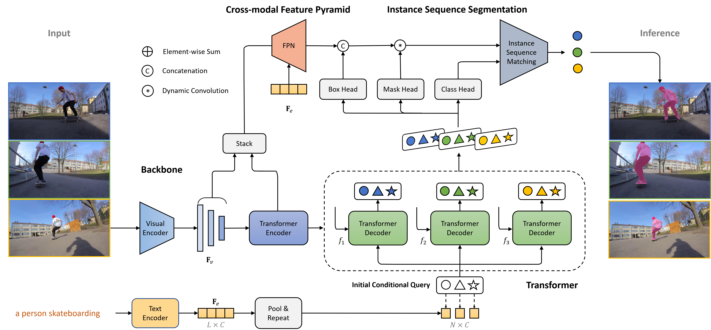

[](https://opensource.org/licenses/Apache-2.0)
[](https://pytorch.org/)

[](https://paperswithcode.com/sota/referring-expression-segmentation-on-refer-1?p=language-as-queries-for-referring-video)
[](https://paperswithcode.com/sota/referring-expression-segmentation-on-a2d?p=language-as-queries-for-referring-video)

The official implementation of the **CVPR2022** paper: 

<div align="center">
<h1>
<b>
Language as Queries for Referring <br> Video Object Segmentation
</b>
</h1>
</div>

<p align="center"></p>

> [**Language as Queries for Referring Video Object Segmentation**](https://arxiv.org/abs/2201.00487)
>
> Jiannan Wu, Yi Jiang, Peize Sun, Zehuan Yuan, Ping Luo

### Abstract

In this work, we propose a simple and unified framework built upon Transformer, termed ReferFormer. It views the language as queries and directly attends to the most relevant regions in the video frames. Concretely, we introduce a small set of object queries conditioned on the language as the input to the Transformer. In this manner, all the queries are obligated to find the referred objects only. They are eventually transformed into dynamic kernels which capture the crucial object-level information, and play the role of convolution filters to generate the segmentation masks from feature maps. The object tracking is achieved naturally by linking the corresponding queries across frames. This mechanism greatly simplifies the pipeline and the end-to-end framework is significantly different from the previous methods. Extensive experiments on Ref-Youtube-VOS, Ref-DAVIS17, A2D-Sentences and JHMDB-Sentences show the effectiveness of ReferFormer. 

## Update
- **(2022/03/11)** We upload the model on Ref-Youtube-VOS by jointly training Ref-Youtube-VOS and Ref-COCO/+/g, which leads to higher performance.
- **(2022/03/03)** ReferFormer is accepted by CVPR2022. 👏

## Demo

- Ref-DAVIS17


- Ref-Youtube-VOS


## Requirements

We test the codes in the following environments, other versions may also be compatible:

- CUDA 11.1
- Python 3.7
- Pytorch 1.8.1


## Installation

Please refer to [install.md](docs/install.md) for installation.

## Data Preparation

Please refer to [data.md](docs/data.md) for data preparation.

We provide the pretrained model for different visual backbones. You may download them [here](https://drive.google.com/drive/u/0/folders/11_qps3q75aH41IYHlXToyeIBUKkfdqso) and put them in the directory `pretrained_weights`.

<!-- For the Swin Transformer and Video Swin Transformer backbones, the weights are intialized using the pretrained model provided in the repo [Swin-Transformer](https://github.com/microsoft/Swin-Transformer) and [Video-Swin-Transformer](https://github.com/SwinTransformer/Video-Swin-Transformer). For your convenience, we upload the pretrained model in the google drives [swin_pretrained](https://drive.google.com/drive/u/0/folders/1QWLayukDJYAxTFk7NPwerfso3Lrx35NL) and [video_swin_pretrained](https://drive.google.com/drive/u/0/folders/19qb9VbKSjuwgxsiPI3uv06XzQkB5brYM). -->


After the organization, we expect the directory struture to be the following:

```
ReferFormer/
├── data/
│   ├── ref-youtube-vos/
│   ├── ref-davis/
│   ├── a2d_sentences/
│   ├── jhmdb_sentences/
├── davis2017/
├── datasets/
├── models/
├── scipts/
├── tools/
├── util/
├── pretrained_weights/
├── eval_davis.py
├── main.py
├── engine.py
├── inference_ytvos.py
├── inference_davis.py
├── opts.py
...
```

## Model Zoo

All the models are trained using 8 NVIDIA Tesla V100 GPU. You may change the `--backbone` parameter to use different backbones (see [here](https://github.com/wjn922/ReferFormer/blob/232b4066fb7d10845e4083e6a5a2cc0af5d1757e/opts.py#L31)).

**Note:** If you encounter the `OOM` error, please add the command `--use_checkpoint` (we add this command for Swin-L, Video-Swin-S and Video-Swin-B models).


### Ref-Youtube-VOS

To evaluate the results, please upload the zip file to the [competition server](https://competitions.codalab.org/competitions/29139#participate-submit_results).

| Backbone| J&F | CFBI J&F  | Pretrain | Model | Submission | CFBI Submission | 
| :----: | :----: | :----: | :----: | :----: | :----: | :----: | 
| ResNet-50 | 55.6 | 59.4 | [weight](https://drive.google.com/file/d/1mJd5zBUv4EYLOKQ0H87-NeAuInyrn577/view?usp=sharing) | [model](https://drive.google.com/file/d/1VKYIbd3tiuLyWkh7ajnIiA3HZ3_IdvxV/view?usp=sharing) | [link](https://drive.google.com/file/d/1IXKu8a06ppPAVBvy4Y0UfcKhCat4HRJt/view?usp=sharing) | [link](https://drive.google.com/file/d/1VJAKZ_j7kQFpocv_vDzER47CXWwAAE8h/view?usp=sharing) |
| ResNet-101 | 57.3 | 60.3 | [weight](https://drive.google.com/file/d/1EMOwwAygdSfTZiVxI4f0UaVd7P6JzmuM/view?usp=sharing) | [model](https://drive.google.com/file/d/1FCHAAMf-HXPhZGTZp748l3pn6FfMyV1L/view?usp=sharing) | [link](https://drive.google.com/file/d/1cFxjVW2RlwjoVYR1M6NlkRpv9L3tPlcZ/view?usp=sharing) | [link](https://drive.google.com/file/d/1RPnFPqf7iiVypc7QbN-ev6s6xfmD-m5c/view?usp=sharing) |
| Swin-T | 58.7 | 61.2 | [weight](https://drive.google.com/file/d/155sZm6yE7YQ8Y8Ln0ShaVZKLejYORqTQ/view?usp=sharing) | [model](https://drive.google.com/file/d/19jIbjRRUGDhfnI604Pw7hcGP5DqdvVtl/view?usp=sharing) | [link](https://drive.google.com/file/d/1eZZ-2zz0gdCwPrislGP3WKAHk-RnNY7v/view?usp=sharing) | [link](https://drive.google.com/file/d/1O9B35oieBfo7sRjxTpSyFz52J2AAHLce/view?usp=sharing) |
| Swin-L | 62.4 | 63.3 | [weight](https://drive.google.com/file/d/1eJKNHvk_KcFuT4k6Te7HDuuSXH2DVOY5/view?usp=sharing) | [model](https://drive.google.com/file/d/1_uwwlWv8AXhHfE8GVId7YtGraznRebaZ/view?usp=sharing) | [link](https://drive.google.com/file/d/1uxBwbKdlilaCNt-RbdcPj1LshA-WY9Q6/view?usp=sharing) | [link](https://drive.google.com/file/d/16kVmJzv5oXzk3zGcfMcb2sEiN6HTOCmW/view?usp=sharing) |
| Video-Swin-T* | 56.0 | - | - | [model](https://drive.google.com/file/d/1V-SZ64BDZtipRJNSEhZWJaRcFnMpTz_h/view?usp=sharing) | [link](https://drive.google.com/file/d/1m9G423Ou82q9ZOQfxoaxn9ERntVoVzFK/view?usp=sharing) | - |
| Video-Swin-T | 59.4 | - | [weight](https://drive.google.com/file/d/1g9Dm1vLdwpwSKVtIZzWKPUk2-zK3IbQa/view?usp=sharing) | [model](https://drive.google.com/file/d/17RL6o_A57giHT-bMuP7ysUGogueT7wYm/view?usp=sharing) | [link](https://drive.google.com/file/d/1nhjvDWgMWufMGAjOKesgyLRB_-Ct6kXP/view?usp=sharing) | - |
| Video-Swin-S | 60.1 | - | [weight](https://drive.google.com/file/d/1GrhFhsUidsVs7-dhY8NkVgWfBZdeit9C/view?usp=sharing) | [model](https://drive.google.com/file/d/1GrhFhsUidsVs7-dhY8NkVgWfBZdeit9C/view?usp=sharing) | [link](https://drive.google.com/file/d/1mhb0UAaJkTFYmGrwXHHJuaXVp-0BSkgm/view?usp=sharing) | - |
| Video-Swin-B | 62.9 | - |[weight](https://drive.google.com/file/d/1MJ1362zjqu-uZdXsSQH6pI1QOFqwv5lY/view?usp=sharing)  | [model](https://drive.google.com/file/d/1nw7D3C_RrKTMzwtzjo39snbYLbv73anH/view?usp=sharing) | [link](https://drive.google.com/file/d/1dAQdr2RqCxYUmOVQ4jFE-vv5zavNhz7B/view?usp=sharing) | - |

\* indicates the model is trained from scratch.

Joint training with Ref-COCO/+/g datasets.
| Backbone| J&F | J | F | Model | Submission | 
| :----: | :----: | :----: | :----: | :----: | :----: |
| ResNet-50 | 58.7 | 57.4 | 60.1 | [model](https://drive.google.com/file/d/1tXgC_GRmQCvHjhlNoT0uXc_0oQ21d0hk/view?usp=sharing) | [link](https://drive.google.com/file/d/1Vbrl11mBfjwpM-H4DOleyD1i2STCN-SM/view?usp=sharing) |
| ResNet-101 | 59.3 | 58.1 | 60.4 | [model](https://drive.google.com/file/d/1LUflgRgwZgTpYr5V9qeDKTIlBjLqHOVj/view?usp=sharing) | [link](https://drive.google.com/file/d/1BANQcqY34SebORZ9_PTF4C-QWuCJl2_W/view?usp=sharing) |
| Swin-L | 64.2 | 62.3 | 66.2 | [model](https://drive.google.com/file/d/1JeppEr8m0O9844xncSfSZrYE_NH8oXb7/view?usp=sharing) | [link](https://drive.google.com/file/d/14klluhPeQhhNKl3EBibtiziChSKfBHU0/view?usp=sharing) |
| Video-Swin-T | 62.6 | 59.9 | 63.3 | [model](https://drive.google.com/file/d/1rVO2ZC4U4symSh9Ifgg68YGdYBZH00MT/view?usp=sharing) | [link](https://drive.google.com/file/d/1-i67hTmo-qpyICbJ9vbTeQdPaL2VnbXQ/view?usp=sharing) |
| Video-Swin-S | 63.3 | 61.4 | 65.2 | [model](https://drive.google.com/file/d/15ifI2yd9oDqMB05DgjhNVMe2MGXVvZnj/view?usp=sharing) | [link](https://drive.google.com/file/d/1II1gZl99FGECkS7DR6B8MszxAKadu-9y/view?usp=sharing) |
| Video-Swin-B | 64.9 | 62.8 | 67.0 | [model](https://drive.google.com/file/d/19XO5VoR6qTE3VNLF-IjYzabL-2tb9E14/view?usp=sharing) | [link](https://drive.google.com/file/d/11FTV-B3MkWfl4azNI-aRmiRqQ9TBXG03/view?usp=sharing) |


### Ref-DAVIS17

As described in the paper, we report the results using the model trained on Ref-Youtube-VOS without finetune.

| Backbone| J&F | J | F | Model | 
| :----: | :----: | :----: | :----: | :----: |
| ResNet-50 | 58.5 | 55.8 | 61.3 | [model](https://drive.google.com/file/d/1VKYIbd3tiuLyWkh7ajnIiA3HZ3_IdvxV/view?usp=sharing) |
| Swin-L | 60.5 | 57.6 | 63.4 | [model](https://drive.google.com/file/d/1_uwwlWv8AXhHfE8GVId7YtGraznRebaZ/view?usp=sharing) |
| Video-Swin-B | 61.1 | 58.1 | 64.1 | [model](https://drive.google.com/file/d/1nw7D3C_RrKTMzwtzjo39snbYLbv73anH/view?usp=sharing) |


### A2D-Sentences

The pretrained models are the same as those provided for Ref-Youtube-VOS.

| Backbone| Overall IoU | Mean IoU | mAP  | Pretrain | Model |
| :----: | :----: | :----: | :----: | :----: | :----: |
| Video-Swin-T* | 72.3 | 64.1 | 48.6 | - | [model](https://drive.google.com/file/d/1z-HO71IcFOZ9A6KD71wAXkbiQgKDpSp7/view?usp=sharing) \| [log](https://drive.google.com/file/d/1JhsXgcWOYv97u6tpAUnBi9-D3mxcHXzO/view?usp=sharing) |
| Video-Swin-T | 77.6 | 69.6 | 52.8 | [weight](https://drive.google.com/file/d/1g9Dm1vLdwpwSKVtIZzWKPUk2-zK3IbQa/view?usp=sharing) | [model](https://drive.google.com/file/d/1z-HO71IcFOZ9A6KD71wAXkbiQgKDpSp7/view?usp=sharing) \| [log](https://drive.google.com/file/d/1xjevouL3a1gHZN5KHtA07Cpa07R4T1Qi/view?usp=sharing) |
| Video-Swin-S | 77.7 | 69.8 | 53.9 | [weight](https://drive.google.com/file/d/1GrhFhsUidsVs7-dhY8NkVgWfBZdeit9C/view?usp=sharing) | [model](https://drive.google.com/file/d/1ng2FAX9J4FyQ7Bq1eeQC9Vvv1W8JZmek/view?usp=sharing) \| [log](https://drive.google.com/file/d/1Uu72THexbtEje4aKXR7Q2Yd4zyPmQsi3/view?usp=sharing) |
| Video-Swin-B | 78.6 | 70.3 | 55.0 | [weight](https://drive.google.com/file/d/1MJ1362zjqu-uZdXsSQH6pI1QOFqwv5lY/view?usp=sharing) | [model](https://drive.google.com/file/d/1WlNjKS_Li-1KoUzuPM4MRM4b-oK2Ka7c/view?usp=sharing) \| [log](https://drive.google.com/file/d/1tH-f9_U0gY-iNfXm6GRyttJp3uvm5NQw/view?usp=sharing) |

\* the model is trained from scratch and set `--num_frames 6`.


### JHMDB-Sentences

As described in the paper, we report the results using the model trained on A2D-Sentences without finetune.

| Backbone| Overall IoU | Mean IoU | mAP  | Model | 
| :----: | :----: | :----: | :----: | :----: | 
| Video-Swin-T* | 70.0 | 69.3 | 39.1 | [model](https://drive.google.com/file/d/1z-HO71IcFOZ9A6KD71wAXkbiQgKDpSp7/view?usp=sharing) | 
| Video-Swin-T | 71.9 | 71.0 | 42.2 | [model](https://drive.google.com/file/d/1z-HO71IcFOZ9A6KD71wAXkbiQgKDpSp7/view?usp=sharing) |
| Video-Swin-S | 72.8 | 71.5 | 42.4 | [model](https://drive.google.com/file/d/1ng2FAX9J4FyQ7Bq1eeQC9Vvv1W8JZmek/view?usp=sharing) |
| Video-Swin-B | 73.0 | 71.8 | 43.7 | [model](https://drive.google.com/file/d/1WlNjKS_Li-1KoUzuPM4MRM4b-oK2Ka7c/view?usp=sharing) | 

\* the model is trained from scratch and set `--num_frames 6`.


## Get Started

Please see [Ref-Youtube-VOS](docs/Ref-Youtube-VOS.md), [Ref-DAVIS17](docs/Ref-DAVIS17.md), [A2D-Sentences](docs/A2D-Sentences.md) and [JHMDB-Sentences](docs/JHMDB-Sentences.md) for details.


## Acknowledgement

This repo is based on [Deformable DETR](https://github.com/fundamentalvision/Deformable-DETR) and [VisTR](https://github.com/Epiphqny/VisTR). We also refer to the repositories [MDETR](https://github.com/ashkamath/mdetr) and [MTTR](https://github.com/mttr2021/MTTR). Thanks for their wonderful works.


## Citation

```
@article{wu2022referformer,
      title={Language as Queries for Referring Video Object Segmentation}, 
      author={Jiannan Wu and Yi Jiang and Peize Sun and Zehuan Yuan and Ping Luo},
      journal={arXiv preprint arXiv:2201.00487},
      year={2022},
}
```

